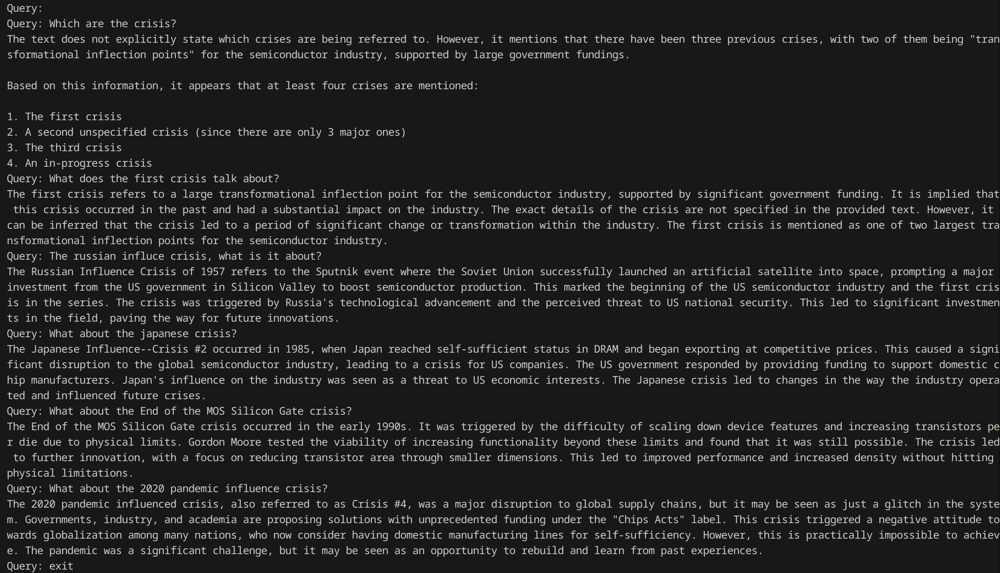

# Requirements

## Install Ollama
```bash
curl -fsSL https://ollama.com/install.sh | sh
```

## Install LLM model to be used for RAG
```bash
ollama run llama3.2:3b-instruct-q8_0
```

Test the model by writing a prompt and checking the answer.

If you get an error for not having enough RAM/VRAM use a smaller quantization:
```bash
ollama run llama3.2:3b-instruct-q4_K_M
```

## Install lib dependecies using Python virtual environments

```bash
python -m venv .venv
pip install -r requirements.txt
```

## Execute the script
The script will load the PDF "kb/2023IRDS_Perspectives.pdf",
then extract the source content from the text found, and store it in a
vector database using PDFMinerLoader.

Then it will ask the user to input a question about the PDF documen,
the answer should have good quality based in the document information.

Using the langchain lib, a prompt is built using a template text,
and relevant information from the parsed knowledge base found in the PDF.

Finally, it will send the embedded prompt to the model and get an answer.

You should see a precise answer based on the information of the document,
if the information is not in the document it won't try to give a false answer.


